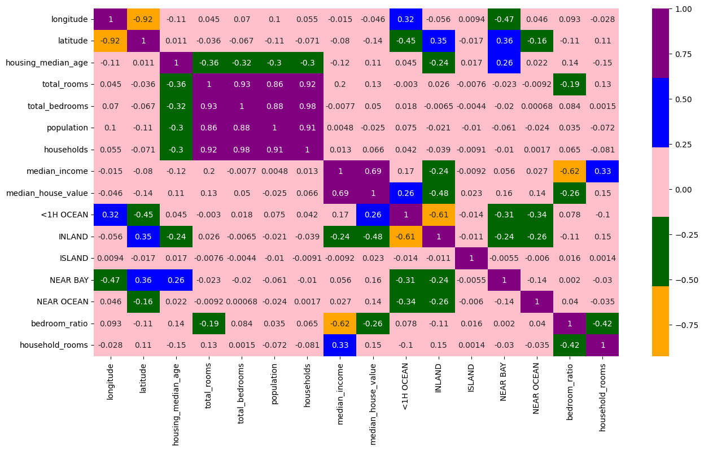
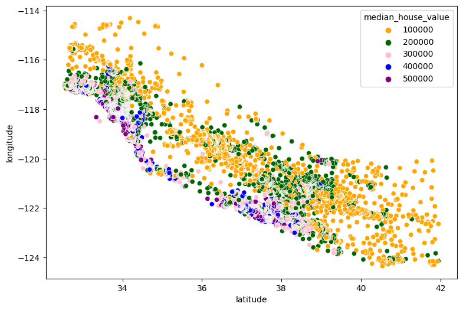
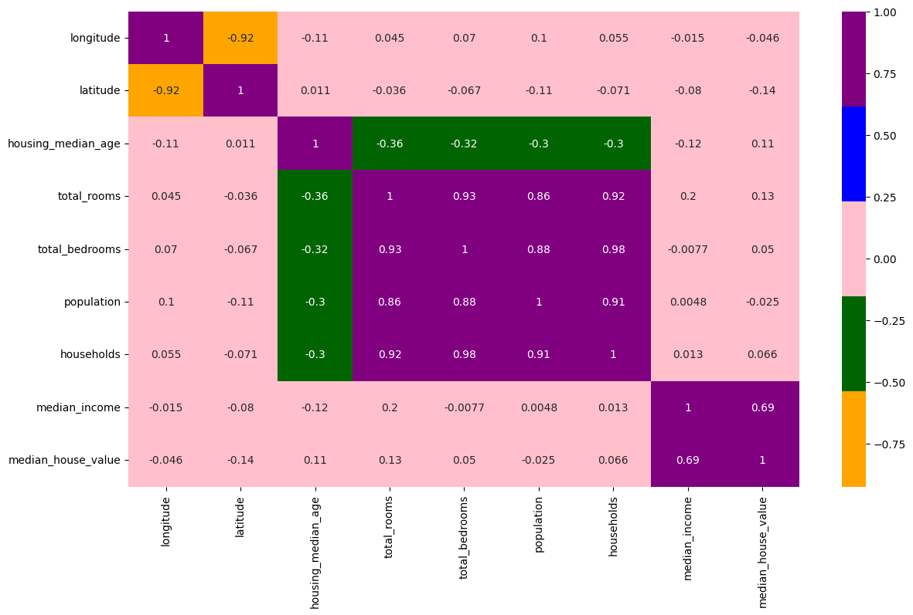
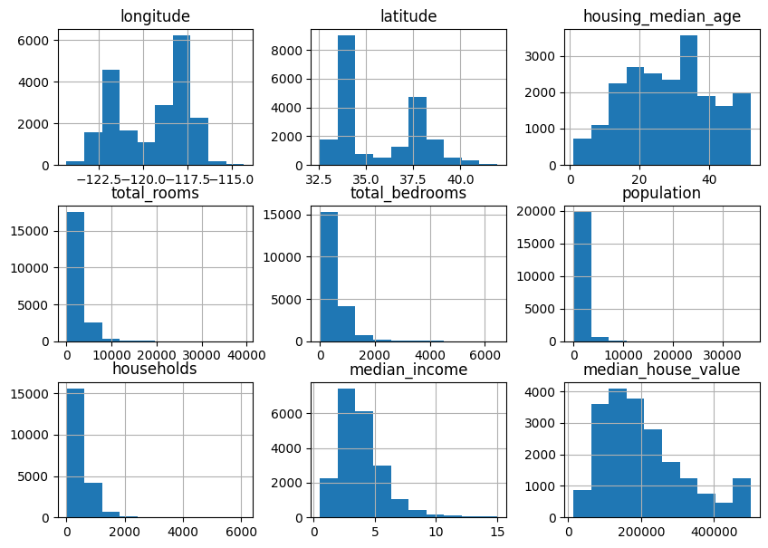

# 🏡 California House Price Prediction using Machine Learning


---

# 📖 Project Overview

This project demonstrates an end-to-end Machine Learning workflow for predicting **California house prices** using the California Housing dataset.

The notebook covers:

- Data loading
- Data exploration
- Data visualization
- Feature engineering
- Data preprocessing
- Model training
- Hyperparameter tuning
- Model evaluation

Two regression models were trained and compared:

- Linear Regression
- Random Forest Regressor

The Random Forest model achieved the best prediction performance after hyperparameter tuning using **GridSearchCV**.

---

# 🎯 Objectives

The aim of this project is to:

- Understand the California Housing dataset
- Explore relationships between housing features
- Build regression models to predict house prices
- Compare multiple machine learning algorithms
- Improve model accuracy through hyperparameter tuning

---

# 📊 Dataset

The project uses the **California Housing Dataset**.

**Dataset File**

```
housing.csv
```

### Dataset Information

- **Rows:** 20,640
- **Columns:** 10

### Features

| Feature | Description |
|----------|-------------|
| Longitude | House longitude |
| Latitude | House latitude |
| Housing Median Age | Median age of houses |
| Total Rooms | Total number of rooms |
| Total Bedrooms | Total bedrooms |
| Population | Population in the district |
| Households | Number of households |
| Median Income | Median income |
| Ocean Proximity | Distance from the ocean |
| Median House Value | Target variable |

---

# 🛠 Technologies Used

- Python
- Pandas
- NumPy
- Matplotlib
- Seaborn
- Scikit-Learn
- Jupyter Notebook

---

# 📂 Project Workflow

## 1. Data Loading

The housing dataset is loaded into a Pandas DataFrame.

```python
df = pd.read_csv("housing.csv")
```

---

## 2. Exploratory Data Analysis (EDA)

The dataset was explored by:

- Viewing dataset information
- Checking data types
- Identifying missing values
- Visualizing feature distributions
- Creating correlation heatmaps

---

## 3. Data Visualization

Several visualizations were created to better understand the dataset.

### Histogram of Numerical Features

This shows the distribution of each numerical variable.



---

### Correlation Heatmap

A heatmap was generated to identify relationships between variables.



---

### Geographic Distribution of House Prices

A scatter plot of latitude and longitude colored by median house value.

This visualization shows that houses located closer to the coast generally have higher prices.



---

### Updated Correlation Heatmap

After feature engineering, a new correlation heatmap was generated.



---

# 🔧 Feature Engineering

Two new features were created:

### Bedroom Ratio

```python
bedroom_ratio = total_bedrooms / total_rooms
```

### Household Rooms

```python
household_rooms = total_rooms / households
```

These engineered features improved the model's predictive performance.

---

# 🧹 Data Preprocessing

The preprocessing steps included:

- Removing the categorical feature temporarily
- One-Hot Encoding the `ocean_proximity` column
- Filling missing values using

```python
fillna(0)
```

- Creating additional numerical features
- Splitting the dataset into training and testing sets

---

# 🤖 Machine Learning Models

## Linear Regression

The first model trained was Linear Regression.

### Performance

**R² Score**

```
0.6674
```

---

## Random Forest Regressor

A Random Forest Regressor was trained to improve prediction accuracy.

### Performance

**R² Score**

```
0.8287
```

---

# 🚀 Hyperparameter Tuning

The Random Forest model was optimized using **GridSearchCV**.

### Parameters Tuned

- Number of Trees (`n_estimators`)
- Maximum Features (`max_features`)
- Minimum Samples Split (`min_samples_split`)

### Best Model

```python
RandomForestRegressor(
    max_features=8,
    n_estimators=200
)
```

---

# 📈 Final Model Performance

| Model | R² Score |
|---------|----------|
| Linear Regression | **0.6674** |
| Random Forest | **0.8287** |
| Tuned Random Forest | **0.8340** |

The tuned Random Forest model achieved the highest prediction accuracy.

---

# 📁 Repository Structure

```
california_house_price_model/
│
├── housing.csv
├── housing.ipynb
├── housing_1.png
├── housing_2.png
├── housing_3.png
├── housing_4.png
└── README.md
```

---

# ▶ How to Run the Project

### Clone the repository

```bash
git clone https://github.com/Star-cj/california_house_price_model.git
```

### Navigate into the project

```bash
cd california_house_price_model
```

### Open the notebook

Launch Jupyter Notebook:

```bash
jupyter notebook
```

Open:

```
housing.ipynb
```

Run all cells to reproduce the analysis, train the models, and evaluate their performance.

---

# 📌 Key Findings

- Median Income is the strongest predictor of house prices.
- Houses closer to the ocean generally have higher values.
- Feature engineering improved model performance.
- Random Forest significantly outperformed Linear Regression.
- Hyperparameter tuning provided a further performance improvement.

---

# 💡 Future Improvements

Possible enhancements include:

- Train XGBoost and LightGBM models
- Save the trained model using Joblib
- Build a Streamlit web application
- Deploy the model online
- Add cross-validation metrics
- Include RMSE and MAE evaluation metrics
- Perform feature importance analysis

---

# 📚 Skills Demonstrated

This project demonstrates practical experience with:

- Data Cleaning
- Exploratory Data Analysis (EDA)
- Data Visualization
- Feature Engineering
- Regression Models
- Machine Learning
- Hyperparameter Tuning
- Model Evaluation
- Python Programming

---

# 👨‍💻 Author

**Chigozie Emeafu**

AI Engineer | Machine Learning Engineer | Data Scientist

GitHub: https://github.com/Star-cj

---

## ⭐ Support

If you found this project helpful or interesting, please consider giving it a ⭐ on GitHub. Your support is greatly appreciated!
